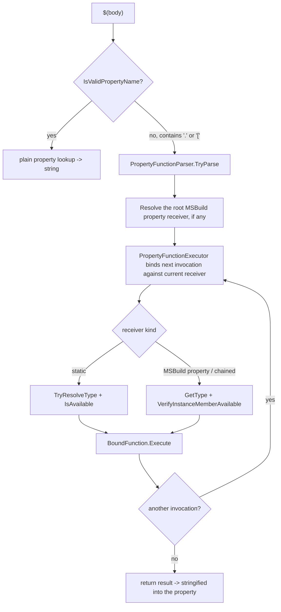

# Property functions: execution model, reachability, and constraints

**Status:** Background analysis. The constraining mode it motivates shipped in PR #14079 (see §10).

**Bottom line:** instance property-function "dotting-in" could reach an open-ended, partly
state-mutating BCL type graph; the receiver surface is now **bounded to a small, rooted allowlist** and
the wide path is gated off (and trim-removed) behind feature switches. The analysis below is why.

> Scope note: this document analyzes which types and members a property-function
> expression can reach by "dotting in" through chained calls. The reachable set
> matters for two engine concerns: **trimming/AOT** - an unbounded receiver surface
> forces the trimmer to root the members of an open-ended BCL type graph for
> reflection, which cannot be made trim-correct - and **the read-only expectation of
> property evaluation** - populating a property is expected to compute a value, so
> members that mutate external state fall outside that contract. The constraining
> design in §10 addresses both by bounding the receiver types to a small, statically
> rooted, side-effect-free set.

## 1. Summary

A *property function* is a call embedded in a `$(...)` property expression, e.g.
`$([System.Math]::Max(1, 2))` (static) or `$(SomeProp.Substring(0, 3))`
(instance). The engine parses the expression, resolves a receiver `Type`, binds a
public member by reflection, invokes it, and feeds the result back into the
remainder of the expression so calls can be **chained** (`$(P.A().B())`).

Two gates are intended to constrain what can be called:

1. **Static calls** are limited to a curated allowlist of types/members
   (plus the MSBuild intrinsics).
2. **Instance calls** are allowed on *any* public member except `GetType`.

The second gate is effectively unbounded. Because each chained call rebinds against
the **runtime type of the previous return value**, any allowlisted static that
returns a rich object (most importantly `System.IO.Directory.GetParent` →
`DirectoryInfo`) exposes that object's entire public surface, and transitively the
connected BCL object graph. This open-ended "dotting-in" reach is the core problem
both for trimming (the reflected member surface that must be rooted is unbounded)
and for the read-only expectation of property evaluation (the reachable surface
includes state-mutating members).

## 2. Where the code lives

The property-function code lives primarily in
[PropertyFunctionParser.cs](../../src/Build/Evaluation/Expander/PropertyFunctionParser.cs),
[Expander.PropertyFunctionExecutor.cs](../../src/Build/Evaluation/Expander.PropertyFunctionExecutor.cs), and
[WellKnownFunctions.cs](../../src/Build/Evaluation/Expander/WellKnownFunctions.cs), with outer property expansion
in [Expander.PropertyExpander.cs](../../src/Build/Evaluation/Expander.PropertyExpander.cs). Parsed argument
segments remain packed in [FunctionArguments.cs](../../src/Build/Evaluation/Expander/FunctionArguments.cs), which
materializes and caches individual expanded values only when a handler or reflection requires them.

| Concern | Member | Location |
| --- | --- | --- |
| Parse, bind, and execute a `$(...)` body | `PropertyExpander<T>.ExpandPropertyBody` | [Expander.PropertyExpander.cs#L366](../../src/Build/Evaluation/Expander.PropertyExpander.cs#L366) |
| Parse the complete root input into ordered invocations | `PropertyFunctionParser.TryParse` | [PropertyFunctionParser.cs#L61](../../src/Build/Evaluation/Expander/PropertyFunctionParser.cs#L61) |
| Split a member name and arguments | `PropertyFunctionParser.ParseMember` | [PropertyFunctionParser.cs#L187](../../src/Build/Evaluation/Expander/PropertyFunctionParser.cs#L187) |
| Parse element access | `PropertyFunctionParser.ParseIndexer` | [PropertyFunctionParser.cs#L233](../../src/Build/Evaluation/Expander/PropertyFunctionParser.cs#L233) |
| Lazily expose source and expanded arguments | `FunctionArguments` | [FunctionArguments.cs](../../src/Build/Evaluation/Expander/FunctionArguments.cs) |
| Supply environmental state during execution | `PropertyFunctionExecutionContext` | [PropertyFunctionExecutionContext.cs](../../src/Build/Evaluation/Expander/PropertyFunctionExecutionContext.cs) |
| Bind and execute one invocation | `PropertyFunctionExecutor.Execute` | [Expander.PropertyFunctionExecutor.Binding.cs](../../src/Build/Evaluation/Expander.PropertyFunctionExecutor.Binding.cs) |
| Resolve a static receiver `Type` | `AvailableStaticMembers.TryResolveType` | [AvailableStaticMembers.cs#L58](../../src/Build/Evaluation/Expander/AvailableStaticMembers.cs#L58) |
| **Static** allow gate | `AvailableStaticMembers.IsAvailable` | [AvailableStaticMembers.cs#L44](../../src/Build/Evaluation/Expander/AvailableStaticMembers.cs#L44) |
| **Instance** allow gate (only blocks `GetType` by default) | `PropertyFunctionExecutor.VerifyInstanceMemberAvailable` | [Expander.PropertyFunctionExecutor.Binding.cs](../../src/Build/Evaluation/Expander.PropertyFunctionExecutor.Binding.cs) |
| Argument coercion fallback | `CoerceArguments` | [Expander.PropertyFunctionExecutor.cs](../../src/Build/Evaluation/Expander.PropertyFunctionExecutor.cs) |
| Late-bound overload resolution | `LateBindExecute` | [Expander.PropertyFunctionExecutor.cs](../../src/Build/Evaluation/Expander.PropertyFunctionExecutor.cs) |
| Public-only binding invariant | `AllowedBindingFlags` + ctor assert | [Expander.PropertyFunctionExecutor.cs](../../src/Build/Evaluation/Expander.PropertyFunctionExecutor.cs) |
| The static allowlist data | `AvailableStaticMembers.CreateAvailableMembers` | [AvailableStaticMembers.cs#L252](../../src/Build/Evaluation/Expander/AvailableStaticMembers.cs#L252) |
| Well-known function fast paths (no reflection) | `WellKnownFunctions.TryExecuteWellKnownFunction` | [WellKnownFunctions.cs](../../src/Build/Evaluation/Expander/WellKnownFunctions.cs) |
| Feature switch / legacy env-var escape hatch (read by **type resolution** and the **gates**) | `FeatureSwitches.EnableAllPropertyFunctions` | [FeatureSwitches.cs](../../src/Framework/FeatureSwitches.cs) |

## 3. Execution model



The complete root input is parsed before execution. `ExpandPropertyBody` then binds and executes each
`PropertyFunctionInvocation` in order, carrying each `functionResult` as the **live object** receiver for the next
invocation ([Expander.PropertyExpander.cs#L430](../../src/Build/Evaluation/Expander.PropertyExpander.cs#L430)).
Strings are escaped after execution to maintain the engine's escaped-data invariant, then unescaped
before use as the next receiver. The binder selects
`receiverValue?.GetType() ?? typeof(string)`
([Expander.PropertyFunctionExecutor.Binding.cs](../../src/Build/Evaluation/Expander.PropertyFunctionExecutor.Binding.cs)) - i.e. the
**runtime type** of the previous result, with its full public surface.

### 3.1 Static call gating is two-stage

A static call `[Type]::Method(...)` is checked twice:

1. **Type resolution** in `AvailableStaticMembers.TryResolveType`
   ([AvailableStaticMembers.cs#L44](../../src/Build/Evaluation/Expander/AvailableStaticMembers.cs#L44)):
   - the allowlist cache, then
   - `Type.GetType(typeName)` against **corelib / the calling assembly only** (no
     assembly-qualified probing), then
   - assembly probing **only** when the `EnableAllPropertyFunctions` feature
     switch is on.
   A type that is neither allowlisted nor in corelib (e.g.
   `System.Diagnostics.Process`) fails here → `InvalidFunctionTypeUnavailable`
   (MSB4212).
2. **Execution gate** in `AvailableStaticMembers.IsAvailable`
   ([AvailableStaticMembers.cs#L99](../../src/Build/Evaluation/Expander/AvailableStaticMembers.cs#L99)): the
   resolved type + method must be in the allowlist (or be `IntrinsicFunctions`,
   or `EnableAllPropertyFunctions` must be set). A corelib type that resolved in
   stage 1 but is not allowlisted (e.g. `System.GC`) fails here →
   `InvalidFunctionMethodUnavailable` (MSB4185).

### 3.2 Instance call gating is effectively unbounded by default

In the **unrestricted** configuration (the untrimmed default), `VerifyInstanceMemberAvailable`
([Expander.PropertyFunctionExecutor.Binding.cs](../../src/Build/Evaluation/Expander.PropertyFunctionExecutor.Binding.cs)) reduces to a single denial:

```csharp
return !string.Equals("GetType", methodName, StringComparison.OrdinalIgnoreCase);
```

so every other public instance method/property/field on the runtime receiver type is callable.
That unbounded surface is exactly what the **now-implemented** receiver restriction bounds: when
`RestrictPropertyFunctionReceivers` is on - the default under trimming, opt-in otherwise - this gate
instead consults the `PropertyFunctionReceiver` allowlist (§10). The reachability analysis in §4-§8
describes the unrestricted surface; §10 is what closes it.

## 4. The static allowlist

Defined in
[`AvailableStaticMembers.CreateAvailableMembers`](../../src/Build/Evaluation/Expander/AvailableStaticMembers.cs#L250).
Two shapes of entry:

- **Whole-type** (every public static is callable): numeric primitives, `Convert`,
  `DateTime`, `DateTimeOffset`, `Enum`, `Guid`, `Math`, `String`, `StringComparer`,
  `TimeSpan`, `Regex`, `Uri`, `UriBuilder`, `Version`, `IO.Path`,
  `RuntimeInformation`, `OSPlatform`, `OperatingSystem`, plus the MSBuild
  intrinsics `IntrinsicFunctions` (`[MSBuild]::`) and `ToolLocationHelper`.
- **Specific-member only** (only the named members are callable, but the receiver
  *type* is still bound, so its full surface is reflected over once you have an
  instance of it): `Environment`, `IO.Directory`, `IO.File`,
  `Globalization.CultureInfo`.

Every allowlisted `File`/`Directory`/`Environment` member is **read-only**. There
is no write/delete/move member anywhere in the allowlist, and `IntrinsicFunctions`
contains no filesystem/registry/process mutator.

## 5. Parameters and conversions

### 5.1 What an argument can be

Arguments are parsed by `PropertyFunctionParser.ParseArguments`: the content between the call parentheses is
split on `,`, with two kinds of span treated atomically (commas inside them do not split):

- a nested property expression `$(...)` (scanned by `ScanForClosingParenthesis`), and
- a quoted span using `` ` ``, `"`, or `'` (scanned by `ScanForClosingQuote`).

Each raw argument remains a packed `StringSegmentRange` at parse time. Empty entries remain empty,
while the unquoted `null` literal is represented by a null range. `FunctionArguments` exposes
those segments directly to well-known handlers and materializes individual arguments only when expansion
or reflection requires them. At execution, `ExpandPropertiesLeaveTypedAndEscaped` can turn a nested
`$()` into a typed object, but a bare literal stays a string (unescaped before being passed out).

Consequence: **you cannot express an arbitrary object argument.** There is no
syntax to construct a `System.Type`, a `byte[]`, a delegate, a `Stream`, a
`FileMode` other than via enum-from-string coercion, etc. This single fact
excludes large swaths of the BCL from being *callable* even though the types are
*reachable* as receivers (see §6 "inadvertent constraints").

### 5.2 How a string becomes a typed parameter

Binding happens in `Execute` in three tiers:

1. **Well-known fast path** - `WellKnownFunctions.TryExecuteWellKnownFunction` handles common
   functions directly from `FunctionArguments`, without reflection and often without
   materializing strings.
2. **Standard binder** - `_receiverType.InvokePublicMember(name, flags, instance, args)`
   lets the default reflection binder match and coerce after arguments are materialized.
3. **Late bind** - on `MissingMethodException`, `LateBindExecute` tries an all-`string`
   signature, then matches by name + argument count and runs `CoerceArguments`.

`CoerceArguments` is the explicit conversion table:

| Parameter type | Conversion |
| --- | --- |
| `char[]` | `arg.ToString().ToCharArray()` |
| an `enum` and the string contains `.` | strip leaf/full type name, `|`→`,`, `Enum.Parse` |
| anything else | `Convert.ChangeType(arg, paramType, InvariantCulture)` |

Failures are swallowed and turned into "no match": `InvalidCastException`,
`FormatException`, and `OverflowException` all return `null`. A parameter type that is not
`IConvertible`-coercible from a string therefore makes the overload silently fail to bind.

### 5.3 Special-case argument handling (in `Execute`)

- **`Equals` / `CompareTo`**: the single argument is `Convert.ChangeType`-d to the
  receiver's runtime type so comparisons line up
  ([Expander.cs#L4162](../../src/Build/Evaluation/Expander.cs#L4162)).
- **`File` / `Directory` / `Path` receivers**: string args run through
  `FileUtilities.FixFilePath`, and `File`/`Directory` path args are made absolute
  against the thread working directory in `-mt` mode
  ([Expander.cs#L4128](../../src/Build/Evaluation/Expander.cs#L4128)).
- **`new`**: routed to a constructor (`TryExecuteWellKnownConstructor` or
  `LateBindExecute` as a constructor). Only public constructors on the resolved
  receiver type are eligible, so object construction is limited to allowlisted
  types (e.g. `[System.Globalization.CultureInfo]::new('en-US')`).
- **`out _`**: overloads are resolved without invocation, then the selected method is invoked once.

### 5.4 Binding is public-only

`AllowedBindingFlags`
([Expander.cs#L3789](../../src/Build/Evaluation/Expander.cs#L3789)) is
`IgnoreCase | Public | Static | Instance | InvokeMethod | GetProperty | GetField`.
`BindingFlags.NonPublic` is never set; the `Function` constructor masks the
incoming flags and asserts the invariant
([Expander.cs#L3853](../../src/Build/Evaluation/Expander.cs#L3853)). Private and
internal members are unreachable.

## 6. Constraints, explicit and inadvertent

### 6.1 Explicit constraints (designed gates)

| Constraint | Code | Effect |
| --- | --- | --- |
| Static type must resolve from allowlist/corelib/(probe) | `AvailableStaticMembers.TryResolveType` [L44](../../src/Build/Evaluation/Expander/AvailableStaticMembers.cs#L44) | non-corelib, non-allowlisted type → "type unavailable" |
| Static method must be allowlisted | `AvailableStaticMembers.IsAvailable` [L99](../../src/Build/Evaluation/Expander/AvailableStaticMembers.cs#L99) | corelib-but-not-allowlisted method → "not available" |
| Instance method must not be `GetType` | `PropertyFunctionExecutor.VerifyInstanceMemberAvailable` | blocks reflection bootstrap via `obj.GetType()` |
| Public-only binding | `AllowedBindingFlags` [L3789](../../src/Build/Evaluation/Expander.cs#L3789) | private/internal members unreachable |

### 6.2 Inadvertent constraints (things that fail to bind by accident)

These are not designed constraints; they are limits of the syntax and the binder that
happen to make many otherwise-reachable members uncallable. They are the reason
the *practical* reachable set is far smaller than a naive type-graph closure.

| Apparent capability | Why it actually fails | Code |
| --- | --- | --- |
| Reflection (`Type`, `Assembly`, `MethodInfo`, ...) | No argument can be a `System.Type`, so `Enum.GetUnderlyingType(Type)` (the only allowlisted member returning `Type`) can't be called; and `obj.GetType()` is blocked. The reflection graph is unreachable despite being in the type closure. | `PropertyFunctionParser.ParseArguments`; `PropertyFunctionExecutor.VerifyInstanceMemberAvailable` |
| `async` overloads returning `Task<T>` | The allowlisted entry points (`File`/`Directory`) don't expose async statics, and reaching async I/O instance methods needs non-string args (`byte[]` buffers) that can't be expressed. | allowlist [AvailableStaticMembers.cs#L250](../../src/Build/Evaluation/Expander/AvailableStaticMembers.cs#L250); `CoerceArguments` [L4700](../../src/Build/Evaluation/Expander.cs#L4700) |
| Methods needing a non-coercible parameter (`Stream`, delegate, complex object) | `Convert.ChangeType` throws → caught → overload returns `null` → `MissingMethodException` → error. | `CoerceArguments` [L4743](../../src/Build/Evaluation/Expander.cs#L4743) |
| Element access `value[i]` | Bound to `Array.GetValue`, `string.get_Chars`, or the receiver's `get_Item` member. | `ParseIndexer` [L233](../../src/Build/Evaluation/Expander/PropertyFunctionParser.cs#L233) |
| Ending a chain on a non-string object | Not an error: the object is `ToString()`-ed into the property, often producing a useless value like `System.Threading.Tasks.Task\`1[...]`. "Works" only if the final value stringifies usefully. | result handling [L4267](../../src/Build/Evaluation/Expander.cs#L4267) |

## 7. Vetted reachability examples

All confirmed against a locally-built bootstrap MSBuild. Representative results:

### 7.1 Reachable via dotting (observed result)

| Expression | Result | Note |
| --- | --- | --- |
| `$([System.IO.Path]::GetFileName('x/HelloWorld').Substring(0,5))` | `Hello` | static → instance chain (normal) |
| `$([System.IO.Directory]::GetParent('F').Parent.FullName)` | parent dir | read-only directory navigation |
| `$(...GetFiles().GetValue(0).OpenRead().Length)` | `15` | array index reaches the open-ended `FileInfo`/`FileStream` surface |
| `$(...GetFiles('n').GetValue(0).OpenWrite().CanWrite)` | `True` | reaches a **state-mutating** member |
| `$(...GetFiles('n').GetValue(0).Delete())` | (empty) | reaches a **state-mutating** member |

From `GetValue(0)` onward the chain flows through `FileInfo`/`FileStream`/`DirectoryInfo` - open-ended
types whose entire public surface would have to be rooted for trimming, several of whose members mutate
state (outside the read-only expectation of property evaluation). §10 bounds the receiver set so these
types are unreachable under the restriction.

### 7.2 Blocked (observed error)

| Expression | Error | Reason |
| --- | --- | --- |
| `$([System.IO.File]::ReadAllTextAsync('F'))` | MSB4185 | async static not allowlisted |
| `$([System.Diagnostics.Process]::GetCurrentProcess().Id)` | MSB4212 | type not allowlisted and not in corelib |
| `$([System.Enum]::GetUnderlyingType('System.DayOfWeek'))` | MSB4186 | `string`→`Type` can't coerce; no way to obtain a `Type` |
| `$(P.GetType().FullName)` | MSB4184 | `GetType` is the one denied instance method |

## 8. Implications and the constraining hook

- **Reads are already a supported capability** (`File::ReadAllText`,
  `Directory::GetFiles`, `[MSBuild]::GetRegistryValue`, `Environment` reads), so
  the read-via-`OpenRead` path adds no new capability - but it still reaches the
  open-ended `Stream` surface, which bounded type rooting must exclude.
- **The members outside the read-only expectation are the state-mutating ones** -
  `OpenWrite`/`Create`/`CopyTo`/`Delete`/`MoveTo`/`CreateSubdirectory` reached
  through `DirectoryInfo`/`FileInfo`. Nothing in the read-only allowlist grants
  these. They run at **evaluation time** (IDE folder open, `restore`, design-time
  builds, `-getProperty`, auto-imported `Directory.Build.props`, NuGet-injected
  `.props`/`.targets`), where populating a property is expected to be a read-only
  computation and no target or task runs.
- The reachable I/O is **local filesystem only** (`HttpClient`/`WebClient` can't be
  constructed; `Uri` does no I/O); there is no reachable network primitive.

The **now-implemented** constraining mode (§10) does exactly this: it hooks `PropertyFunctionExecutor.VerifyInstanceMemberAvailable`
([Expander.PropertyFunctionExecutor.Binding.cs](../../src/Build/Evaluation/Expander.PropertyFunctionExecutor.Binding.cs)), giving it the receiver runtime
`Type`, and enforces an **allowlist of side-effect-free receiver types** (string, primitives, `DateTime`/`TimeSpan`/
`Version`/`Guid`/`decimal`, `CultureInfo`, `Uri`, `Regex`/`Match`, enums) over a
member deny-list - a small, statically known set the trimmer can root, rather than the
open BCL closure. Because dir-walk idioms such as
`$([System.IO.Directory]::GetParent($(X)).Parent.FullName)` are common in real
builds, the restriction is **opt-in under the JIT** (the `RestrictPropertyFunctionReceivers`
feature switch, default off) and **forced on under trimming** - a `[FeatureSwitchDefinition]` rather
than a `Trait` (which the trimmer keeps) or a `ChangeWave` (time-boxed opt-*outs*), so it folds to a
constant and the unbounded branch is removed. The full trim-safe design is in §10.

## 9. The existing escape hatch and trim-time substitution

`MSBUILDENABLEALLPROPERTYFUNCTIONS=1` widens reachability in untrimmed builds. The important trim
detail is that the environment variable is read through the
`FeatureSwitches.EnableAllPropertyFunctions` property, not directly at the call sites:

- **The gates** `AvailableStaticMembers.IsAvailable`
  ([AvailableStaticMembers.cs#L99](../../src/Build/Evaluation/Expander/AvailableStaticMembers.cs#L99)) and
  `PropertyFunctionExecutor.VerifyInstanceMemberAvailable`
  ([Expander.PropertyFunctionExecutor.Binding.cs](../../src/Build/Evaluation/Expander.PropertyFunctionExecutor.Binding.cs)) read
  `FeatureSwitches.EnableAllPropertyFunctions`, so the "anything goes" branch is guarded by a
  trimmer-substitutable property.
- **Type resolution** `AvailableStaticMembers.TryResolveType`
  ([AvailableStaticMembers.cs#L44](../../src/Build/Evaluation/Expander/AvailableStaticMembers.cs#L44)) reads
  `FeatureSwitches.EnableAllPropertyFunctions`
  ([FeatureSwitches.cs](../../src/Framework/FeatureSwitches.cs)), a
  `[FeatureSwitchDefinition]` for `Microsoft.Build.EnableAllPropertyFunctions`. In untrimmed builds,
  when the AppContext switch is unset, that property honors the legacy environment variable. Under
  trimming the property is substituted with the constant `false`, so the assembly-probing branch and
  its `[RequiresUnreferencedCode]` helpers (`GetTypeFromAssembly`
  [L4509](../../src/Build/Evaluation/Expander.cs#L4509),
  `GetTypeFromAssemblyUsingNamespace`
  [L4467](../../src/Build/Evaluation/Expander.cs#L4467)) are removed.

**Consequence.** In a *trimmed* application both the assembly-probing path and the wide
property-function gates are removed, and no runtime setting can re-enable them. In an untrimmed
application, the legacy environment variable still behaves as before when no AppContext switch was set.

## 10. Constraining mode (implemented in #14079)

**Status: implemented (PR #14079).** The unbounded instance "dotting-in" surface analyzed above is now
bounded by an opt-in / trim-forced receiver-type restriction.

What shipped:

- A receiver allowlist, [`PropertyFunctionReceiver`](../../src/Build/Evaluation/PropertyFunctionReceiver.cs),
  gated by the `RestrictPropertyFunctionReceivers` feature switch in
  [`FeatureSwitches`](../../src/Framework/FeatureSwitches.cs). The wide property-function gates now read
  `FeatureSwitches.EnableAllPropertyFunctions` (a `[FeatureGuard]` switch) instead of the old `Traits`
  environment read, so the trimmer can substitute a constant and remove the unbounded branch.
- The allowlist is a small, static `typeof(...)` set of side-effect-free receivers (`string`, the numeric
  primitives, `bool`/`char`, `DateTime`/`DateTimeOffset`/`TimeSpan`, `Guid`, `Version`, `CultureInfo`,
  `Uri`, `Regex`/`Match`/`Group`/`Capture`, plus any enum). Directory/file navigation is allowed via a
  **member** allowlist (`FullName`, `Name`, `Exists`, `Parent`, `Root`, `Extension`, `Length`, `Directory`,
  `DirectoryName`) that excludes every state-mutating member (`Open*`, `Create*`, `CopyTo`, `MoveTo`,
  `Delete`, ...), so the common `$([System.IO.Directory]::GetParent($(X)).Parent.FullName)` idiom keeps
  working while `FileInfo.OpenWrite`/`Delete` become unreachable.

**Why a feature switch (not a `Trait` or a `ChangeWave`):** a `Trait` is a runtime environment read the
trimmer keeps, so it could not satisfy "no runtime re-enablement under trimming"; a
`[FeatureSwitchDefinition]` is substituted to a constant and its dead branch removed. ChangeWaves are
time-boxed opt-*outs*; this is a permanent trim boundary that must be non-disableable under trimming.

**Behavior:** the untrimmed default is **wide** (unchanged - opt in via the
`Microsoft.Build.RestrictPropertyFunctionReceivers` AppContext switch, which has no environment variable);
a trimmed/AOT MSBuild **enforces the restriction by default**, and no runtime setting (including
`MSBUILDENABLEALLPROPERTYFUNCTIONS=1`) can re-open the removed branches. The one remaining suppression is
the `InvokePublicMember` call in [Expander.cs](../../src/Build/Evaluation/Expander.cs), whose
`DynamicallyAccessedMembers` justification is now honest because only allowlisted receiver types flow to it.
