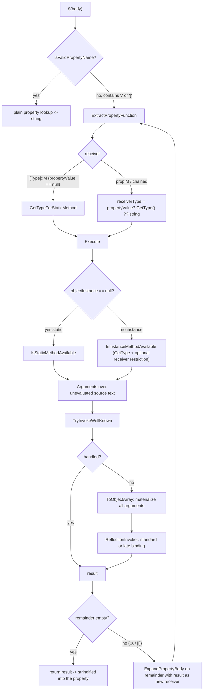

# Property functions: execution model, reachability, and constraints

**Status:** Background analysis. The constraining mode it motivates shipped in PR #14079 (see §10).

**Bottom line:** instance property-function "dotting-in" could reach an open-ended, partly
state-mutating BCL type graph; the receiver surface is now **bounded to a small, rooted allowlist** and
the wide path is gated off (and trim-removed) behind feature switches. The analysis below is why.

> Scope note: this document analyzes which types and members a property-function
> expression can reach by "dotting in" through chained calls. The reachable set
> matters for two engine concerns: **trimming/AOT** - an unbounded receiver surface
> forces the trimmer to root the members of an open-ended BCL type graph for
> reflection, which cannot be made trim-correct - and **the read-only expectation of
> property evaluation** - populating a property is expected to compute a value, so
> members that mutate external state fall outside that contract. The constraining
> design in §10 addresses both by bounding receivers to a small, statically rooted
> surface that excludes external state mutation.

## 1. Summary

A *property function* is a call embedded in a `$(...)` property expression, e.g.
`$([System.Math]::Max(1, 2))` (static) or `$(SomeProp.Substring(0, 3))`
(instance). The engine parses the expression, resolves a receiver `Type`, dispatches
an optimized well-known implementation or binds a public member by reflection,
invokes it, and feeds the result back into the remainder of the expression so calls
can be **chained** (`$(P.A().B())`).

Historically, two gates constrained what could be called:

1. **Static calls** are limited to a curated allowlist of types/members
   (plus the MSBuild intrinsics).
2. **Instance calls** are allowed on *any* public member except `GetType` in the
   unrestricted configuration.

The second gate is effectively unbounded in that configuration. Because each chained call rebinds
against the **runtime type of the previous return value**, any allowlisted static that
returns a rich object (most importantly `System.IO.Directory.GetParent` →
`DirectoryInfo`) exposes that object's entire public surface, and transitively the
connected BCL object graph. This open-ended "dotting-in" reach is the core problem
both for trimming (the reflected member surface that must be rooted is unbounded)
and for the read-only expectation of property evaluation (the reachable surface
includes state-mutating members).

## 2. Where the code lives

The current property-function path lives in the `Expander<P, I>` partial class and its
non-generic support types. [ExpanderFactory](../../src/Build/Expansion/ExpanderFactory.cs)
selects it by default when its change wave is enabled. The compatibility implementation
remains under [Expansion/Legacy](../../src/Build/Expansion/Legacy) as
`LegacyExpander<P, I>` and can be selected by the change wave or escape hatch. The
execution model below describes the current `Expander<P, I>` path; the reachability
constraints are shared by both implementations.

| Concern | Member | Location |
| --- | --- | --- |
| Select the current or compatibility implementation | `ExpanderFactory.CreateCore` | [ExpanderFactory.cs](../../src/Build/Expansion/ExpanderFactory.cs) |
| Parse a `$(...)` body into a function and recurse the chain | `PropertyExpander.ExpandPropertyBody` | [Expander.PropertyExpander.cs](../../src/Build/Evaluation/Expander.PropertyExpander.cs) |
| Split a comma-separated argument list (atomic `$()` / quotes) | `ExtractFunctionArguments` | [Expander.cs](../../src/Build/Evaluation/Expander.cs) |
| Extract receiver/method/args/remainder; **derive receiver type** | `Function.ExtractPropertyFunction` | [Expander.Function.cs](../../src/Build/Evaluation/Expander.Function.cs) |
| Split method name / arguments / remainder | `Function.ConstructFunction` | [Expander.Function.cs](../../src/Build/Evaluation/Expander.Function.cs) |
| Execute, escape the result, and recurse the remainder | `Function.Execute` | [Expander.Function.cs](../../src/Build/Evaluation/Expander.Function.cs) |
| Materialize and cache source arguments on demand | `Arguments` + `IArgumentMaterializer` | [Arguments.cs](../../src/Build/Evaluation/Expander/Arguments.cs), [IArgumentMaterializer.cs](../../src/Build/Evaluation/Expander/IArgumentMaterializer.cs) |
| Dispatch optimized implementations without reflection | `TryInvokeWellKnown` + `WellKnownFunctions.TryInvoke*` | [Expander.Function.cs](../../src/Build/Evaluation/Expander.Function.cs), [WellKnownFunctions.cs](../../src/Build/Evaluation/Expander/WellKnownFunctions.cs) |
| Bind and invoke the reflection fallback | `TryInvokeWithReflection` + `ReflectionInvoker` | [Expander.Function.cs](../../src/Build/Evaluation/Expander.Function.cs), [ReflectionInvoker.cs](../../src/Build/Evaluation/Expander/ReflectionInvoker.cs) |
| Coerce arguments for well-known and reflection paths | `ArgumentParser` + `ReflectionInvoker.TryGetCoercedArguments` | [ArgumentParser.cs](../../src/Build/Evaluation/Expander/ArgumentParser.cs), [ReflectionInvoker.cs](../../src/Build/Evaluation/Expander/ReflectionInvoker.cs) |
| Resolve a static receiver `Type` | `GetTypeForStaticMethod` | [Expander.Function.cs](../../src/Build/Evaluation/Expander.Function.cs) |
| **Static** allow gate | `IsStaticMethodAvailable` | [Expander.Function.cs](../../src/Build/Evaluation/Expander.Function.cs) |
| **Instance** allow gate | `IsInstanceMethodAvailable` | [Expander.Function.cs](../../src/Build/Evaluation/Expander.Function.cs) |
| Public-only binding invariant | `AllowedBindingFlags` + constructor checks | [Expander.Function.cs](../../src/Build/Evaluation/Expander.Function.cs), [ReflectionInvoker.cs](../../src/Build/Evaluation/Expander/ReflectionInvoker.cs) |
| The static allowlist data | `AvailableStaticMethods.InitializeAvailableMethods` | [Constants.cs](../../src/Build/Resources/Constants.cs) |
| Feature switch / legacy env-var escape hatch (read by **type resolution** and the **gates**) | `FeatureSwitches.EnableAllPropertyFunctions` | [FeatureSwitches.cs](../../src/Framework/FeatureSwitches.cs) |

## 3. Execution model


```mermaid
flowchart TD
    A["$(body)"] --> B{IsValidPropertyName?}
    B -->|yes| P[plain property lookup -> string]
    B -->|"no, contains '.' or '['"| C[ExtractPropertyFunction]
    C --> D{receiver}
    D -->|"[Type]::M (propertyValue == null)"| E[GetTypeForStaticMethod]
    D -->|"prop.M / chained"| F["receiverType = propertyValue?.GetType() ?? string"]
    E --> G[Execute]
    F --> G[Execute]
    G --> H{objectInstance == null?}
    H -->|yes static| I[IsStaticMethodAvailable]
    H -->|no instance| J["IsInstanceMethodAvailable (GetType + optional receiver restriction)"]
    I --> K["Arguments over unevaluated source text"]
    J --> K
    K --> W[TryInvokeWellKnown]
    W --> WH{handled?}
    WH -->|yes| R[result]
    WH -->|no| MA["ToObjectArray: materialize all arguments"]
    MA --> RI["ReflectionInvoker: standard or late binding"]
    RI --> R
    R --> L{remainder empty?}
    L -->|yes| M[return result -> stringified into the property]
    L -->|"no (.X / [i])"| C2[ExpandPropertyBody on remainder with result as new receiver]
    C2 --> C
```

The chaining recursion is the crux. `Execute` finishes by calling
`PropertyExpander.ExpandPropertyBody(_remainder, result, ...)`. The result is carried
as a **live object** - most string results are escaped (`Escape`, `Unescape`, and
`ConvertFromBase64` are exempt), but other types remain typed. When the remainder is parsed,
`Function.ExtractPropertyFunction` derives the next receiver type from
`propertyValue?.GetType() ?? typeof(string)` - i.e. the **runtime type** of the
previous result. In the unrestricted configuration its full public surface is then
a candidate for invocation.

### 3.1 Static call gating is two-stage

A static call `[Type]::Method(...)` is checked twice:

1. **Type resolution** in
   [`GetTypeForStaticMethod`](../../src/Build/Evaluation/Expander.Function.cs):
   - the allowlist cache (`AvailableStaticMethods.GetTypeInformationFromTypeCache`), then
   - `Type.GetType(typeName)`, which resolves simple names from corelib / the calling
     assembly and honors an explicitly assembly-qualified name, then
   - additional assembly-by-name / namespace probing **only** when the
     `EnableAllPropertyFunctions` feature switch is on.
   A simple type name that is neither allowlisted nor in corelib (e.g.
   `System.Diagnostics.Process`) fails here → `InvalidFunctionTypeUnavailable`
   (MSB4212).
2. **Execution gate** in
   [`IsStaticMethodAvailable`](../../src/Build/Evaluation/Expander.Function.cs): the
   resolved type + method must be in the allowlist (or be `IntrinsicFunctions`,
   or `EnableAllPropertyFunctions` must be set). A corelib type that resolved in
   stage 1 but is not allowlisted (e.g. `System.GC`) fails here →
   `InvalidFunctionMethodUnavailable` (MSB4185).

### 3.2 Instance call gating is effectively unbounded by default

In the **unrestricted** configuration (the untrimmed default),
[`IsInstanceMethodAvailable`](../../src/Build/Evaluation/Expander.Function.cs)
reduces to a single denial:

```csharp
return !string.Equals("GetType", methodName, StringComparison.OrdinalIgnoreCase);
```

so every other public instance method/property/field on the runtime receiver type is callable.
That unbounded surface is exactly what the **now-implemented** receiver restriction bounds: when
`RestrictPropertyFunctionReceivers` is on - the default under trimming, opt-in otherwise - this gate
instead consults the `PropertyFunctionReceiver` allowlist (§10). The reachability analysis in §4-§8
describes the unrestricted surface; §10 is what closes it.

## 4. The static allowlist

Defined in
[`AvailableStaticMethods.InitializeAvailableMethods`](../../src/Build/Resources/Constants.cs).
Two shapes of entry:

- **Whole-type** (every public static is callable): numeric primitives, `Convert`,
  `DateTime`, `DateTimeOffset`, `Enum`, `Guid`, `Math`, `String`, `StringComparer`,
  `TimeSpan`, `Regex`, `Uri`, `UriBuilder`, `Version`, `IO.Path`,
  `RuntimeInformation`, `OSPlatform`, `OperatingSystem`, plus the MSBuild
  intrinsics `IntrinsicFunctions` (`[MSBuild]::`) and `ToolLocationHelper`.
- **Specific-member only** (only the named members are callable, but the receiver
  *type* is still bound, so its full surface can be reflected over once you have an
  instance of it in the unrestricted configuration): `Environment`, `IO.Directory`, `IO.File`,
  `Globalization.CultureInfo`.

Every allowlisted `File`/`Directory`/`Environment` member is **read-only**. There
is no write/delete/move member anywhere in the allowlist, and `IntrinsicFunctions`
contains no filesystem/registry/process mutator.

## 5. Parameters and conversions

### 5.1 What an argument can be

Arguments are parsed by
[`ExtractFunctionArguments`](../../src/Build/Evaluation/Expander.cs): the content
between the call parentheses is split on `,`, with two kinds of span treated
atomically (commas inside them do not split):

- a nested property expression `$(...)` (scanned by `ScanForClosingParenthesis`), and
- a quoted span using `` ` ``, `"`, or `'` (scanned by `ScanForClosingQuote`).

Each raw argument is therefore a **string** at parse time, except that the unquoted
literal `null` is represented as `null`. Empty entries are retained
as empty strings. At execution, `Function.Execute` wraps the source values in
[`Arguments`](../../src/Build/Evaluation/Expander/Arguments.cs). Well-known
handlers request only the indexes they need; `Function` implements
[`IArgumentMaterializer`](../../src/Build/Evaluation/Expander/IArgumentMaterializer.cs)
to expand each requested argument through `ExpandPropertiesLeaveTypedAndEscaped`,
apply path normalization, unescape it, and cache the typed result. A nested `$()`
*can* therefore yield a typed object, but a bare literal stays a string.

If no well-known handler accepts the call, `TryInvokeWithReflection` calls
`Arguments.ToObjectArray()`, which materializes every remaining argument in index
order before reflection begins. Materialization failures are therefore kept outside
the reflection exception boundary. On the direct path, `TryInvokeWellKnown` handles
an invocation failure only when `Arguments.AllMaterialized` is true, so a
materialization failure likewise propagates unchanged.

Consequence: **you cannot express an arbitrary object argument.** An argument can
be a literal, `null`, or the typed result of a nested property expression (which can
produce values such as arrays), but only types reachable from available property
functions can be supplied. There is no normal path to construct a `System.Type`,
delegate, or arbitrary complex object; enum parameters can also be supplied through
string coercion. This excludes large swaths of the BCL from being *callable* even
though their types may appear in a naive receiver graph (see §6 "inadvertent
constraints").

### 5.2 How a string becomes a typed parameter

`Execute` first attempts direct dispatch, then falls back to reflection:

1. **Well-known dispatch** - `TryInvokeWellKnown` routes static, instance, and
   constructor calls to typed handlers in `WellKnownFunctions`. These handlers use
   `Arguments` and `ArgumentParser`, avoiding reflection and unnecessary argument
   materialization.
2. **Reflection preparation** - `TryInvokeWithReflection` materializes the full
   argument array and applies the `Equals` / `CompareTo` compatibility conversion.
3. **Standard binder** - `ReflectionInvoker.InvokeMember` calls
   `_receiverType.InvokePublicMember(...)`. Calls containing `out _` instead enumerate
   candidates through `GetMethodResult`.
4. **Late binding** - after a method `MissingMethodException`, or for a constructor,
   `ReflectionInvoker` prefers an exact all-`string` signature, then matches public
   members by name and arity and attempts explicit coercion.

`ReflectionInvoker.TryGetCoercedArguments` uses this conversion table:

| Parameter type | Conversion |
| --- | --- |
| `char[]` | `arg.ToString().ToCharArray()` |
| an `enum` and the string contains `.` | strip leaf/full type name, `|`→`,`, `Enum.Parse` |
| anything else | `Convert.ChangeType(arg, paramType, InvariantCulture)` |

Failures are turned into "no match": `InvalidCastException`, `FormatException`, and
`OverflowException` all make `TryGetCoercedArguments` return `false`. An argument
that cannot be converted by these rules therefore makes that candidate fail to bind.

### 5.3 Special-case argument handling

- **`Equals` / `CompareTo`**: before reflection, `AdjustForEqualsAndCompareTo`
  converts the single argument to the receiver's runtime type so comparisons line up.
- **`File` / `Directory` / `Path` receivers**: string args run through
  `FileUtilities.FixFilePath`, and `File`/`Directory` path args are made absolute
  against the thread working directory in `-mt` mode. This happens during lazy
  materialization in `Function.MaterializeArgument`.
- **`new`**: first routed to `WellKnownFunctions.TryInvokeConstructor`; otherwise
  `ReflectionInvoker.InvokeConstructor` performs late constructor binding. Only
  public constructors on the resolved receiver type are eligible, so object
  construction is limited to allowlisted types under the normal gates (e.g.
  `[System.Globalization.CultureInfo]::new('en-US')`).
- **`out _`**: `ReflectionInvoker.InvokeMember` detects placeholders, defaults each
  candidate parameter type, and tries candidates through `GetMethodResult`.
- **Indexers**: `ConstructIndexerFunction` maps arrays to `GetValue`, strings to
  `get_Chars`, and other indexers to `get_Item`; their arguments use the same
  materialization and binding paths.

### 5.4 Binding is public-only

[`AllowedBindingFlags`](../../src/Build/Evaluation/Expander.Function.cs) is
`IgnoreCase | Public | Static | Instance | InvokeMethod | GetProperty | GetField`.
`BindingFlags.NonPublic` is never set; the `Function` constructor masks the
incoming flags and asserts the invariant, and `ReflectionInvoker` rejects any
`BindingFlags.NonPublic` input. Private and internal members are unreachable.

## 6. Constraints, explicit and inadvertent

### 6.1 Explicit constraints (designed gates)

| Constraint | Code | Effect |
| --- | --- | --- |
| Static type must resolve from allowlist, `Type.GetType`, or escape-hatch probing | [`GetTypeForStaticMethod`](../../src/Build/Evaluation/Expander.Function.cs) | unresolved type → "type unavailable" |
| Outside the escape hatch, a static method must be allowlisted | [`IsStaticMethodAvailable`](../../src/Build/Evaluation/Expander.Function.cs) | resolved-but-not-allowlisted method → "not available" |
| Outside the escape hatch, an instance member must not be `GetType` | [`IsInstanceMethodAvailable`](../../src/Build/Evaluation/Expander.Function.cs) | blocks reflection bootstrap via `obj.GetType()` |
| Under receiver restriction, the receiver/member pair must be allowlisted | [`PropertyFunctionReceiver.IsAllowed`](../../src/Build/Evaluation/PropertyFunctionReceiver.cs) | blocks the open-ended instance receiver graph |
| Public-only binding | [`AllowedBindingFlags`](../../src/Build/Evaluation/Expander.Function.cs) + [`ReflectionInvoker`](../../src/Build/Evaluation/Expander/ReflectionInvoker.cs) | private/internal members unreachable |

### 6.2 Inadvertent constraints (things that fail to bind by accident)

These are not designed constraints; they are limits of the syntax and the binder that
happen to make many otherwise-reachable members uncallable. They are the reason
the *practical* reachable set is far smaller than a naive type-graph closure.

| Apparent capability | Why it actually fails | Code |
| --- | --- | --- |
| Reflection (`Type`, `Assembly`, `MethodInfo`, ...) | Under the normal gates, no available expression produces a `System.Type`: `Enum.GetUnderlyingType(Type)` first needs one, and `obj.GetType()` is blocked. The reflection graph is therefore unreachable despite appearing in the type closure. | [`ExtractFunctionArguments`](../../src/Build/Evaluation/Expander.cs); [`IsInstanceMethodAvailable`](../../src/Build/Evaluation/Expander.Function.cs) |
| Methods needing a non-coercible parameter (`Stream`, delegate, complex object) | When no nested property expression can produce the required type, `Convert.ChangeType` throws → coercion reports no match → `MissingMethodException` → error. | [`ReflectionInvoker.TryGetCoercedArguments`](../../src/Build/Evaluation/Expander/ReflectionInvoker.cs) |
| Ending a chain on a non-string object | Not an error: `PropertyExpander.ConvertToString` has special handling for dictionaries and enumerables, then falls back to invariant `Convert.ToString`, often producing a useless value such as `System.Threading.Tasks.Task\`1[...]`. "Works" only if the final value converts usefully. | [`PropertyExpander.ConvertToString`](../../src/Build/Evaluation/Expander.PropertyExpander.cs) |

## 7. Vetted reachability examples

All confirmed against a locally-built bootstrap MSBuild. Representative results:

### 7.1 Reachable via dotting (observed result)

| Expression | Result | Note |
| --- | --- | --- |
| `$([System.IO.Path]::GetFileName('x/HelloWorld').Substring(0,5))` | `Hello` | static → instance chain (normal) |
| `$([System.IO.Directory]::GetParent('F').Parent.FullName)` | parent dir | read-only directory navigation |
| `$(...GetFiles().GetValue(0).OpenRead().Length)` | `15` | array index reaches the open-ended `FileInfo`/`FileStream` surface |
| `$(...GetFiles('n').GetValue(0).OpenWrite().CanWrite)` | `True` | reaches a **state-mutating** member |
| `$(...GetFiles('n').GetValue(0).Delete())` | (empty) | reaches a **state-mutating** member |

From `GetValue(0)` onward the chain flows through `FileInfo`/`FileStream`/`DirectoryInfo` - open-ended
types whose entire public surface would have to be rooted for trimming, several of whose members mutate
state (outside the read-only expectation of property evaluation). §10 bounds the receiver set so these
types are unreachable under the restriction.

### 7.2 Blocked (observed error)

| Expression | Error | Reason |
| --- | --- | --- |
| `$([System.IO.File]::ReadAllTextAsync('F'))` | MSB4185 | async static not allowlisted |
| `$([System.Diagnostics.Process]::GetCurrentProcess().Id)` | MSB4212 | type not allowlisted and not in corelib |
| `$([System.Enum]::GetUnderlyingType('System.DayOfWeek'))` | MSB4186 | `string`→`Type` can't coerce; no way to obtain a `Type` |
| `$(P.GetType().FullName)` | MSB4184 | `GetType` is the one denied instance method |

## 8. Implications and the constraining hook

- **Reads are already a supported capability** (`File::ReadAllText`,
  `Directory::GetFiles`, `[MSBuild]::GetRegistryValue`, `Environment` reads), so
  the read-via-`OpenRead` path adds no new capability - but it still reaches the
  open-ended `Stream` surface, which bounded type rooting must exclude.
- **The members outside the read-only expectation are the state-mutating ones** -
  `OpenWrite`/`Create`/`CopyTo`/`Delete`/`MoveTo`/`CreateSubdirectory` reached
  through `DirectoryInfo`/`FileInfo`. Nothing in the read-only allowlist grants
  these. They run at **evaluation time** (IDE folder open, `restore`, design-time
  builds, `-getProperty`, auto-imported `Directory.Build.props`, NuGet-injected
  `.props`/`.targets`), where populating a property is expected to be a read-only
  computation and no target or task runs.
- The reachable I/O is **local filesystem only** (`HttpClient`/`WebClient` can't be
  constructed; `Uri` does no I/O); there is no reachable network primitive.

The **now-implemented** constraining mode (§10) does exactly this: it hooks
[`IsInstanceMethodAvailable`](../../src/Build/Evaluation/Expander.Function.cs), giving it the receiver
runtime `Type`, and enforces a **bounded allowlist of receiver types** (string, primitives, arrays,
`DateTime`/`TimeSpan`/`Version`/`Guid`/`decimal`, `CultureInfo`, `Uri`, `Regex`/`Match`, enums), plus
a read-only member allowlist for `FileSystemInfo` receivers - a small, statically known surface the
trimmer can root, rather than the open BCL closure.
Because dir-walk idioms such as
`$([System.IO.Directory]::GetParent($(X)).Parent.FullName)` are common in real
builds, the restriction is **opt-in under the JIT** (the `RestrictPropertyFunctionReceivers`
feature switch, default off) and **forced on under trimming** - a `[FeatureSwitchDefinition]` rather
than a `Trait` (which the trimmer keeps) or a `ChangeWave` (time-boxed opt-*outs*), so it folds to a
constant and the unbounded branch is removed. The full trim-safe design is in §10.

## 9. The existing escape hatch and trim-time substitution

`MSBUILDENABLEALLPROPERTYFUNCTIONS=1` widens reachability in untrimmed builds. The important trim
detail is that the environment variable is read through the
`FeatureSwitches.EnableAllPropertyFunctions` property, not directly at the call sites:

- **The gates**
  [`IsStaticMethodAvailable`](../../src/Build/Evaluation/Expander.Function.cs) and
  [`IsInstanceMethodAvailable`](../../src/Build/Evaluation/Expander.Function.cs) read
  `FeatureSwitches.EnableAllPropertyFunctions`, so the "anything goes" branch is guarded by a
  trimmer-substitutable property.
- **Type resolution**
  [`GetTypeForStaticMethod`](../../src/Build/Evaluation/Expander.Function.cs) reads
  `FeatureSwitches.EnableAllPropertyFunctions`
  ([FeatureSwitches.cs](../../src/Framework/FeatureSwitches.cs)), a
  `[FeatureSwitchDefinition]` for `Microsoft.Build.EnableAllPropertyFunctions`. In untrimmed builds,
  when the AppContext switch is unset, that property honors the legacy environment variable. Under
  trimming the property is substituted with the constant `false`, so the assembly-probing branch and
  its `[RequiresUnreferencedCode]` helpers (`GetTypeFromAssembly` and
  `GetTypeFromAssemblyUsingNamespace` in
  [Expander.Function.cs](../../src/Build/Evaluation/Expander.Function.cs)) are removed.

**Consequence.** In a *trimmed* application both the assembly-probing path and the wide
property-function gates are removed, and no runtime setting can re-enable them. In an untrimmed
application, the legacy environment variable still behaves as before when no AppContext switch was set.

## 10. Constraining mode (implemented in #14079)

**Status: implemented (PR #14079).** The unbounded instance "dotting-in" surface analyzed above is now
bounded by an opt-in / trim-forced receiver-type restriction.

What shipped:

- A receiver allowlist, [`PropertyFunctionReceiver`](../../src/Build/Evaluation/PropertyFunctionReceiver.cs),
  gated by the `RestrictPropertyFunctionReceivers` feature switch in
  [`FeatureSwitches`](../../src/Framework/FeatureSwitches.cs). The wide property-function gates now read
  `FeatureSwitches.EnableAllPropertyFunctions` (a `[FeatureGuard]` switch) instead of the old `Traits`
  environment read, so the trimmer can substitute a constant and remove the unbounded branch.
- The whole-surface receiver allowlist is a small, static set of value-like and text-processing types
  (`string`, the numeric primitives, `bool`/`char`, `DateTime`/`DateTimeOffset`/`TimeSpan`, `Guid`,
  `Version`, `CultureInfo`, `Uri`, `Regex`/`Match`/`Group`/`Capture`) plus any enum or array.
  Directory/file navigation is allowed via a
  **member** allowlist containing read-only metadata and navigation such as `FullName`, `Name`, `Exists`,
  `Parent`, `Root`, `Extension`, `Length`, `Directory`, `DirectoryName`, attributes, and timestamps. It
  excludes every state-mutating member (`Open*`, `Create*`, `CopyTo`, `MoveTo`, `Delete`, ...), so the
  common `$([System.IO.Directory]::GetParent($(X)).Parent.FullName)` idiom keeps working while
  `FileInfo.OpenWrite`/`Delete` become unreachable.

**Why a feature switch (not a `Trait` or a `ChangeWave`):** a `Trait` is a runtime environment read the
trimmer keeps, so it could not satisfy "no runtime re-enablement under trimming"; a
`[FeatureSwitchDefinition]` is substituted to a constant and its dead branch removed. ChangeWaves are
time-boxed opt-*outs*; this is a permanent trim boundary that must be non-disableable under trimming.

**Behavior:** the untrimmed default is **wide** (unchanged - opt in via the
`Microsoft.Build.RestrictPropertyFunctionReceivers` AppContext switch, which has no environment variable);
a trimmed/AOT MSBuild **enforces the restriction by default**, and no runtime setting (including
`MSBUILDENABLEALLPROPERTYFUNCTIONS=1`) can re-open the removed branches. The current implementation
localizes its remaining false-positive suppressions to receiver-type flow in
`FunctionBuilder.SetReceiverType` and `Function.AdjustForEqualsAndCompareTo`, type resolution in
`Function.GetTypeForStaticMethod`, and public-only binding in `ReflectionInvoker`. The compatibility
`LegacyExpander` retains equivalent suppressions while it remains compiled. All are tracked in
[aot-trim-suppressions.md](aot-trim-suppressions.md); their `DynamicallyAccessedMembers`
justification is honest because only allowlisted receiver types flow to reflection under trimming.
